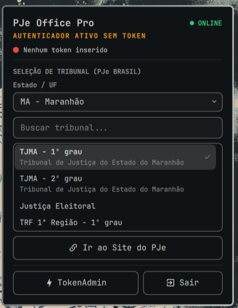

# Omarchy PJeOffice Pro & Token Monitor

[](https://plugins.omarchy.org)
[](LICENSE)

---

[🇧🇷 Português](#-português) • [🇺🇸 English](#-english)

---

## 🇧🇷 Português

BarWidget e monitor em segundo plano do **PJeOffice Pro**, autenticadores de certificados digitais A3 (SafeSign, StarSign CUT, etc.) e acesso rápido unificado aos tribunais brasileiros com suporte a PJe para o ambiente [Omarchy](https://omarchy.org).

<p align="center">
  
</p>

### 🚀 Recursos

- **Monitoramento em Segundo Plano:** Detecta automaticamente se o serviço local do PJeOffice Pro (`http://127.0.0.1:8800/`) está ativo.
- **Detecção de Token Criptográfico A3:** Monitora via `opensc-tool` a inserção e identificação de cartões inteligentes e tokens USB (ex: StarSign CUT S).
- **Acesso Rápido a Tribunais (PJe Brasil):** Filtro e pesquisa em tempo real por Estado (UF) e nome/apelido de tribunais (TJ, TRF, TRT, etc.) sincronizados com a base nacional do PJe Navegador.
- **Controle do Ciclo de Vida:** Botões integrados para abrir o **TokenAdmin** ou **Sair** (encerrar o processo do autenticador de forma limpa).
- **Ocultação Inteligente:** Quando o serviço está offline, o widget se retrai e desocupa espaço na barra ou gaveta.

### 📋 Pré-requisitos

- **Omarchy Quattro** (com `omarchy-shell` / Quickshell).
- **PJeOffice Pro** instalado no sistema.
- **OpenSC** (`opensc`) para comunicação com tokens criptográficos (`opensc-tool`).

### 📦 Instalação

```bash
omarchy plugin add https://github.com/andrecards12/omarchy-pjeoffice.git --enable
```

> **Hospedagem no Tray (Gaveta do Segundo Plano):**
> Você pode usá-lo na barra principal ou simplesmente arrastá-lo (drag & drop) para dentro da gaveta retrátil do **Tray** (`io.github.tyrichards.tray`), atrás da setinha `<`.
> Ou se preferir via arquivo, adicione `"id": "io.github.andrecards12.pjeoffice"` dentro do array `widgets` do tray em `~/.config/omarchy/shell.json`.

### 🗑️ Remoção

```bash
omarchy plugin remove io.github.andrecards12.pjeoffice --yes
```

---

## 🇺🇸 English

Status bar widget and background manager for **PJeOffice Pro**, cryptographic A3 tokens (SafeSign, StarSign CUT, etc.), and quick unified access to Brazilian court electronic judicial systems (PJe) on [Omarchy](https://omarchy.org).

<p align="center">
  
</p>

### 🚀 Features

- **Background Service Monitoring:** Automatically detects if the local PJeOffice Pro daemon (`http://127.0.0.1:8800/`) is online.
- **A3 Cryptographic Token Detection:** Tracks USB smart cards and digital certificate tokens using `opensc-tool`.
- **National Courts Directory (PJe Brasil):** Real-time search and state (UF) filtering for Brazilian state and federal courts (TJ, TRF, TRT).
- **Lifecycle Management:** One-click shortcuts to launch **TokenAdmin** or securely **Quit** the backend service.
- **Smart Space Reservation:** Hides itself when offline so it doesn't take up bar or drawer space.

### 📋 Prerequisites

- **Omarchy Quattro** (`omarchy-shell` / Quickshell).
- **PJeOffice Pro** installed.
- **OpenSC** (`opensc`) installed for smart card / token detection.

### 📦 Installation

```bash
omarchy plugin add https://github.com/andrecards12/omarchy-pjeoffice.git --enable
```

> **Tray Drawer Hosting (Background Drawer):**
> You can place it on the main bar or drag and drop it into the collapsible **Tray** drawer (`io.github.tyrichards.tray`) behind the chevron `<`.
> Alternatively, add `"id": "io.github.andrecards12.pjeoffice"` to the `widgets` list of the tray in `~/.config/omarchy/shell.json`.

### 🗑️ Uninstallation

```bash
omarchy plugin remove io.github.andrecards12.pjeoffice --yes
```

---

## License

Distributed under the [MIT](LICENSE) License.
